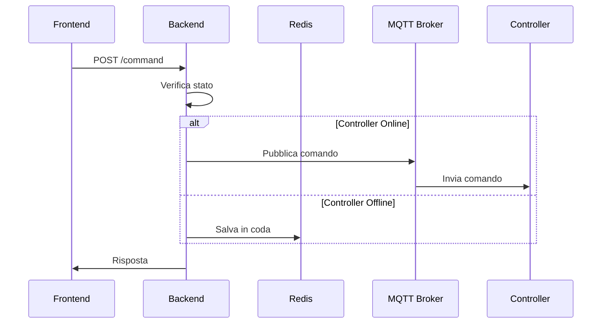

# Sistema di Controllo Irrigazione - Documentazione Tecnica

## 🌟 Panoramica
Sistema di controllo remoto per apparati di irrigazione che permette di monitorare e controllare irrigatori tramite un'applicazione web, gestendo anche situazioni di connettività instabile.

## 📝 Requisiti e Implementazione

### 1. Monitoraggio Stato Controllori
**Requisito:** Conoscere lo stato dei propri controllori (capire se connessi)

**Implementato con:**
```javascript
// Backend: Aggiornamento stato via MQTT
client.on('message', async (topic, message) => {
    if (topic.endsWith('/status')) {
        const status = JSON.parse(message.toString());
        await pool.query(
            'UPDATE controllers SET status = $1, last_seen = CURRENT_TIMESTAMP WHERE id = $2',
            [status.online, controllerId]
        );
    }
});

// Frontend: Visualizzazione stato
const getSystemStatus = () => {
    if (!controller.status) {
        return { label: "Offline", classes: "bg-red-100 text-red-800" };
    }
};
```

### 2. Monitoraggio Stato Irrigatori
**Requisito:** Conoscere lo stato degli irrigatori (capire se stanno irrigando o meno)

**Implementato con:**
```javascript
// Backend: Tracciamento stato irrigatori
if (status.sprinklers) {
    await pool.query(
        'UPDATE sprinklers SET status = $1, duration = $2 WHERE id = $3',
        [sprinklerStatus.isIrrigating, sprinklerStatus.duration, sprinklerId]
    );
}

// Frontend: Visualizzazione stato
<span className={`text-sm ${sprinkler.status ? "text-green-600" : "text-gray-500"}`}>
    {sprinkler.status ? `Attivo (${sprinkler.duration}m)` : "Inattivo"}
</span>
```

### 3. Gestione Comandi Irrigazione
**Requisito:** Impartire comandi di accensione (1/5/10/30/60 minuti) o spegnimento

**Implementato con:**
```javascript
// Backend: API endpoint per comandi
app.post('/api/controllers/:controllerId/sprinklers/:sprinklerId/command', 
    async (req, res) => {
    const { command, duration } = req.body;
    // Logica gestione comando...
});

// Frontend: Interfaccia durata
<select value={selectedDurations[sprinkler.id] || 5}>
    <option value={1}>1 minuto</option>
    <option value={5}>5 minuti</option>
    <option value={10}>10 minuti</option>
    <option value={30}>30 minuti</option>
    <option value={60}>60 minuti</option>
</select>
```

### 4. Gestione Connessione Instabile
**Requisito:** Recapito dei comandi quando il controllore torna raggiungibile

**Implementato con:**
```javascript
// Salvataggio comandi offline
if (!controller_status) {
    await redis.rpush(`commands:${controllerId}`, JSON.stringify(commandData));
}

// Processamento comandi al ritorno online
async function processQueuedCommands(controllerId) {
    const command = await redis.lpop(`commands:${controllerId}`);
    if (command) {
        mqtt.publish(`controllers/${controllerId}/command`, command);
    }
}
```

## 🔄 Flusso dei Dati



### Processo Dettagliato:

1. **Invio Comando**
   - Frontend → Backend (HTTP)
   - Verifica stato controllore
   - Se online: MQTT
   - Se offline: Redis

2. **Gestione Stato**
   - Controllore → MQTT (status)
   - Backend aggiorna DB
   - Frontend polling ogni 10s

3. **Recupero Comandi**
   - Controllore pubblica stato online
   - Backend verifica Redis
   - Invio comandi pendenti
   - Aggiornamento storico

4. **Conferme**
   - Controllore → MQTT (ACK)
   - Backend aggiorna DB
   - Frontend aggiorna vista

## 🛠 Tecnologie

- **Frontend**: React, TailwindCSS
- **Backend**: Express.js, Node.js
- **Database**: PostgreSQL
- **Cache**: Redis
- **Messaggistica**: MQTT
- **Container**: Docker, Docker Compose

## 📊 Schema Database

```sql
CREATE TABLE controllers (
    id SERIAL PRIMARY KEY,
    name VARCHAR(100) NOT NULL,
    status BOOLEAN DEFAULT false,
    last_seen TIMESTAMP
);

CREATE TABLE sprinklers (
    id SERIAL PRIMARY KEY,
    controller_id INTEGER REFERENCES controllers(id),
    name VARCHAR(100) NOT NULL,
    status BOOLEAN DEFAULT false,
    duration INTEGER
);
```

## 📡 Endpoint e Topics

### API REST
- `GET /api/controllers`: Lista controllori e stato
- `POST /api/controllers/:id/sprinklers/:id/command`: Invio comandi

### MQTT Topics
- `controllers/{id}/command`: Invio comandi
- `controllers/{id}/status`: Stato controllore
- `controllers/{id}/command_ack`: Conferme

## 🚀 Deployment

```bash
# Avvio sistema
docker-compose up -d

# Backup database
./backup.sh
```

## 📝 Note
- Il polling è impostato a 10 secondi per bilanciare reattività e carico
- I comandi offline vengono gestiti in ordine FIFO
- Lo stato del controllore viene considerato offline dopo 30 secondi senza aggiornamenti